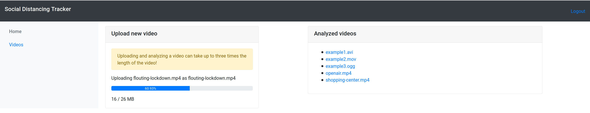
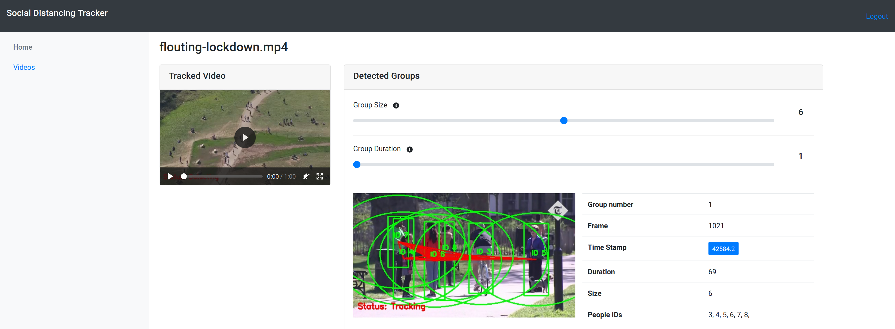

# Social Distancing Tracker
Tool that detects when people do not follow the social distancing rules by analyzing videos from
surveillance cameras.





## Setup

Tested on Ubuntu 18.04

### Social Distancing Tracker
```shell script
$ cd people_detection
```

* Set up virtual environment:
```shell script
$ sudo apt-get install python3-venv
$ python3 -m venv venv
$ source venv/bin/activate
```
* Install dependencies (NB: the dlib dependency requires at least >2GB RAM and needs to be created from a clean
                        virtual environment)
```shell script
$ sudo apt-get install build-essential cmake libopenblas-dev liblapack-dev libx11-dev libgtk-3-dev python3-dev
$ pip install -vr requirements.txt
```
* Run tracker
```shell script
python group_detection.py [path to video/stream] -o [path of output directory]
```

### UI
We provide a web-based UI that allows you to upload videos and get them analyzed.

```
$ cd app/
```

* Install [MongoDB Community Edition](https://docs.mongodb.com/manual/tutorial/install-mongodb-on-ubuntu/)

* Create database:
```shell script
$ mongo
> use MyDatabase;
> exit
```

* Open `index.js` and adapt user credentials:
```javascript
UserDetails.register({username:'anna', active: false}, 'anna');
```

* Install ffmpeg to convert videos
```shell script
$ sudo apt-get install ffmpeg
```

* Install node.js and dependencies:
```shell script
$ curl -o- https://raw.githubusercontent.com/nvm-sh/nvm/v0.35.3/install.sh | bash
# open new terminal after that
$ nvm install stable
$ npm install
```
* Run application
```
$ node index.js
```
* Open browser and type:
```
localhost:3000
```
